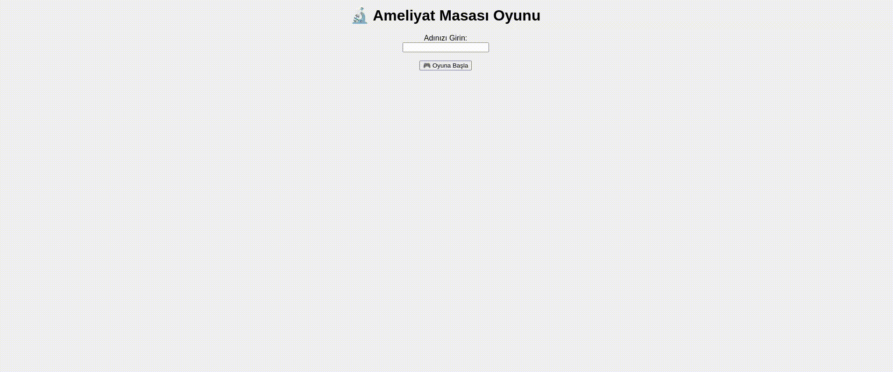

# ameliyat-oyunu

Ameliyat Masası Oyunu, Python (Flask) ve JavaScript kullanılarak geliştirilmiş interaktif bir mini oyundur. Oyuncuların, çeşitli cerrahi aletleri (neşter, pens, makas vb.) ameliyat masasının doğru bölgelerine (ön, arka, sağ, sol) belirli bir süre içerisinde yerleştirmesi beklenir.

🎮 Nasıl Oynanır?
Oyun başladığında rastgele bir cerrahi alet görünür.

Oyuncu, bu aleti doğru konuma sürükleyip bırakmalı veya ilgili butona tıklayarak konumunu seçmelidir.

Her doğru yerleştirme için 10 puan kazanılır.

Süre bitiminde puanlar hesaplanır ve skor tablosunda gösterilir.

🧠 Kullanılan Teknolojiler
Python (Flask): Backend servisi, zaman ve skor takibi için.

JavaScript: Oyunun tüm etkileşimli yapısı, zamanlayıcı ve kullanıcı arayüzü için.

HTML/CSS: Görsel yapı ve stil.
